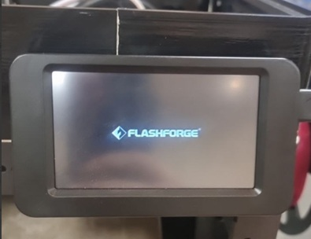
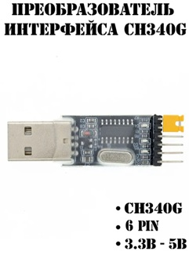
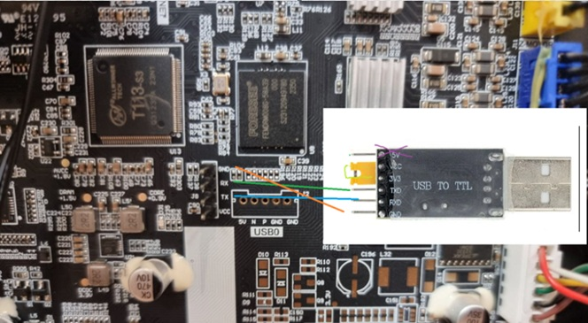
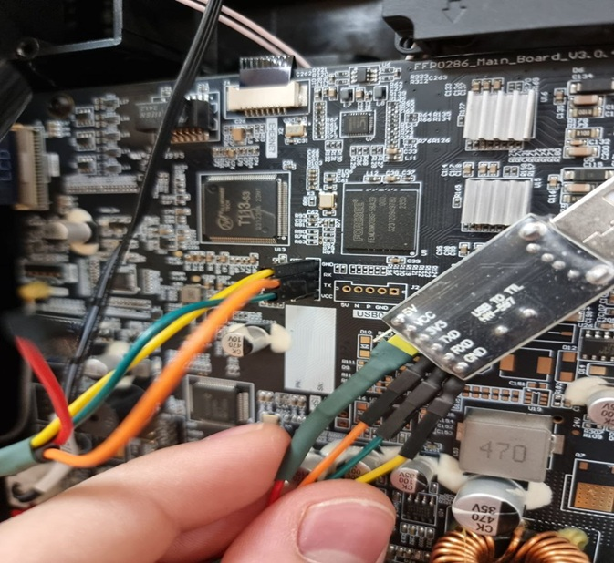
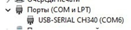

### [Installation](#installieren-des-mods)

### Drucker auf Werkseinstellungen zurücksetzen (erforderlich für die Installation des Mods)

0. [KlipperMod](https://github.com/xblax/flashforge_ad5m_klipper_mod/blob/master/docs/UNINSTALL.md) deinstallieren, wenn er installiert wurde
1. Setzen Sie den Drucker auf die Standardeinstellungen zurück.
2. den USB-Stick auf FAT/FAT16/FAT32 formatieren
3. Legen Sie die Datei von [Native Firmware](/de/Native_FW/) in den Stammordner des USB-Flash-Laufwerks

    - [Adventurer5M-3.1.9-2.2.3-20250807-Factory.tgz](https://github.com/ghzserg/FF/releases/download/R/Adventurer5M-3.1.9-2.2.3-20250807-Factory.tgz) für FF5m
    - [Adventurer5MPro-3.1.3-2.2.3-20250107-Factory.tgz](https://github.com/ghzserg/FF/releases/download/R/Adventurer5MPro-3.1.3-2.2.3-20250107-Factory.tgz) für FF5m**Pro** Version
    - [AD5X-1.1.7-1.1.0-3.0.6-20250912.tgz](https://github.com/ghzserg/FF/releases/download/R/AD5X-1.1.7-1.1.0-3.0.6-20250912-Factory.tgz) für AD5X

4. Schalten Sie den Drucker aus
5. Stecken Sie den USB-Stick in den Drucker
6. Schalten Sie den Drucker ein
7. Warten Sie, bis die native Firmware installiert ist.
8. WiFi oder Lan einrichten *neuer Biber*
9. Laden Sie die neuesten Drucker-Updates herunter oder installieren Sie die Firmware 1.1.7 für AD5X bzw. 3.2.3 für [AD5M](https://github.com/ghzserg/FF/releases/download/R/Adventurer5M-3.2.3-2.2.3-20251016-Factory.tgz) / [AD5MPro](https://github.com/ghzserg/FF/releases/download/R/Adventurer5MPro-3.2.3-2.2.3-20251017-Factory.tgz), wenn der [Drucker die Bettmitte nicht vor jedem Druckvorgang](/de/FAQ/#vor-jedem-druckvorgang-misst-der-drucker-die-mitte-des-druckbetts) messen soll.

---

## Installieren des Mods

[Video](https://www.youtube.com/watch?v=2sfb2OtY7wM)

1. **[Drucker auf Werkseinstellungen zurücksetzen](/de/Setup/#drucker-auf-werkseinstellungen-zurücksetzen-erforderlich-für-die-installation-des-mods)** - [Vorsicht AD5X](/de/Setup/#achtung-ad5x)
2. formatieren Sie den USB-Stick auf FAT/FAT16/FAT32
3. Legen Sie die [Datei](https://github.com/ghzserg/zmod/releases/) im Stammverzeichnis des USB-Flash ab.

    - für FF5M: Adventurer5M-**zmod**-\*.tgz
    - für FF5MPro: Adventurer5MPro-**zmod**-\*.tgz
    - für *[AD5X](/de/AD5X/)*: AD5X-**zmod**-\*.tgz

4. Schalten Sie den Drucker aus
5. Stecken Sie den USB-Stick in den Drucker
6. Schalten Sie den Drucker ein
7. Warten Sie auf die Installation des Mods

   
   
   
   
   Auf dem AD5X kann die Installation bis zu **40 Minuten** dauern.

8. Entfernen Sie den USB-Stick
9. Schalten Sie den Drucker aus
10. Schalten Sie den Drucker ein
11. **Drucker-IP im Browser öffnen**
    
    
    
    Wenn sich das Webinterface nicht öffnet, hat die native Firmware den Mod deaktiviert. Um sie zu aktivieren, müssen Sie die USB-Flash-Datei [AD5X-ENABLE-zmod.tgz](https://github.com/ghzserg/FF/releases/download/R/AD5X-ENABLE-zmod.tgz) und [activate mod](/de/Native_FW/#zmod-auf-ad5x-aktivieren) installieren.
     
12. Übersetzen Sie den Mod in Ihrer Sprache.
    
    
    
    Oder geben Sie in der Konsole ````LANG LANG=ru``` für die passende Sprache ein.
    
    

13. Konfigurieren Sie den Mod
    
    
    
    Dies zeigt die Parameter, die am Anfang und am Ende verwendet werden, sowie die globalen Parameter. Es wird empfohlen, die Einstellungen nur zu lesen, sie aber nicht zu ändern. Die Werte der einzelnen Einstellungen können [hier](/de/Global/) eingesehen werden.

    

    Sie müssen zum letzten Bildschirm gelangen und auf "OK" oder "Neustart" drücken. Wenn Sie das nicht tun, wird dieses Fenster bei jedem Start erscheinen

    

    Wenn Sie dieses Fenster wieder sehen wollen - dann geben Sie `GLOBAL` in die Konsole ein

14. Gehen Sie zu `Einstellungen` :arrow_right: `Software Updates`.
15. Klicken Sie auf "Nach Updates suchen" und warten Sie, bis die Updates geprüft wurden.
16. Klicken Sie auf **Update** und aktualisieren Sie alle Komponenten.
    

    Wenn es viele Fehler anzeigt, ist das normal. Plugins sind nicht Teil der Firmware und werden separat heruntergeladen. Sie müssen auf **Nach Updates suchen** klicken.
    Stellen Sie dann alle Plug-ins wieder her und aktualisieren Sie sie nacheinander. Der Drucker wird neu gestartet.
    
    

17. Aktivieren Sie das [Empfehlungs-Plugin](https://github.com/ghzserg/recommend/blob/main/Readme.md)
    
    

    Oder geben Sie in der Konsole ````ENABLE_PLUGIN name=recommend``` ein.

    

18. [Orca-Slicer anpassen](/de/Recommendations/#send-files-to-print-octoklipper)
    Der gesamte Startcode muss durch diesen ersetzt werden:

    ```
    START_PRINT EXTRUDER_TEMP=[nozzle_temperature_initial_layer] BED_TEMP=[bed_temperature_initial_layer_single]
    M190 S[bed_temperature_initial_layer_single]
    M104 S[düse_temperatur_anfangsschicht]
    SET_PRINT_STATS_INFO TOTAL_LAYER=[total_layer_count]
    ```
    
    ```START_PRINT EXTRUDER_TEMP= BED_TEMP=``` **muss in eine Zeile geschrieben werden**

    Der endgültige Code zu diesem:

    ```END_PRINT```

    

    Code, bevor Sie die Ebene in diese ändern:

    ```SET_PRINT_STATS_INFO CURRENT_LAYER={layer_num + 1}```.

    

    Es ist notwendig, auf das Protokoll "Octo/Klipper" umzuschalten:

      - Protokoll: `Octo/Klipper`.
          - Hostname: `IP-Druckername:7125`.
          - Url-Adresse des Hosts: `IP_printer` oder `IP_printer:80`

    
    

19. [MD5-Kontrolle aktivieren](/de/Recommendations/#aktivieren-sie-die-md5-kontrolle)

    

20. [Lesen Sie die Empfehlungen](/de/Recommendations/)
21. [FAQ lesen](/de/FAQ/)
22. [Drucker-Kalibrierung](/de/SetupCalibrations/)

### Achtung AD5X

[@Khamai](https://t.me/Khamai)

Nach der Installation der nativen Firmware kann es vorkommen, dass der Druckkopf nicht korrekt gegen den Filamentempfänger positioniert ist (der Empfängerverschluss ist möglicherweise nicht vollständig geschlossen, Filament kann auf das Bett gedrückt werden usw.).

[Über das Engineering-Menü der nativen Firmware](/de/AD5X/#abfallbehälter-setup-auf-nativer-ad5x-firmware)

Wenn Sie auf diese Situation stoßen, müssen Sie das Parken mit Hilfe des folgenden Algorithmus kalibrieren:

1. Laden Sie das Archiv [Set.XY.Offset.zip](https://github.com/ghzserg/FF/releases/download/R/Set.XY.Offset.zip) herunter und entpacken Sie es in das Stammverzeichnis des Flash-Laufwerks
2. Stecken Sie den USB-Stick in den ausgeschalteten Drucker und schalten Sie ihn ein.
Die Kalibrierungsschnittstelle wird auf dem Bildschirm des Druckers angezeigt. Sie müssen auf Reset drücken.

4. Verwenden Sie die Steuerpfeile, um den Druckkopf so am Empfänger zu parken, dass der Druckkopf genügend Druck auf den Verschlusshebel ausübt, die Düse hinter dem beweglichen Verschluss liegt und der Verschluss selbst mit der Vorderseite des Empfängers bündig ist.
5. Sichern Sie das Kalibrierungsergebnis mit der Set-Taste.
6. Entfernen Sie den Speicherstick und starten Sie den Drucker neu.

---

## Aktualisieren Sie den Mod

Wenn die Meldung (`Z-Mod über USB aktualisieren`) angezeigt wird, müssen Sie die Aktualisierung per USB durchführen, auch wenn sie erst kürzlich erfolgt ist.

**Bei der Aktualisierung per USB bleiben alle Daten erhalten.**

**Einfachste Methode:** Verwenden Sie das Makro [ZFLASH](/de/Zmod/#zflash). Stecken Sie den USB-Stick ein, starten Sie den Drucker neu und führen Sie `ZFLASH` aus. Das Makro führt folgende Schritte aus:

- Suche nach der neuesten Version.

- Herunterladen der neuesten Version für Ihr Druckermodell.

- Überprüfung der Prüfsummen.

- Neustart des Druckers.

- Automatische Installation des Updates (lassen Sie den USB-Stick für zukünftige Updates eingesteckt).

Nach der Installation:

1. Öffnen Sie Fluidd/(Mainsail) :arrow_right: `Einstellungen/(Maschine)` :arrow_right: `Software-Update`.

2. Klicken Sie auf „Nach Updates suchen“ und installieren Sie die neuesten Z-Mod-Updates.


Wenn es viele Fehler anzeigt, ist das normal.

Denn die Plugins sind nicht Teil der Firmware und werden separat heruntergeladen.

Sie müssen auf **"Nach Updates suchen"** klicken. Und die Plug-ins nacheinander wiederherstellen und aktualisieren. Der Drucker wird neu gestartet.


**Versionskompatibilität:**

- Die Betriebssystemversion:

!!! info "Hinweis Fluidd"
	(unter `System` :arrow_right: `Distribution`)

!!! info "Hinweis Mainsail"
	(`Maschine` :arrow_right: `Systemauslastung(Host)`)

muss mit den ersten beiden Ziffern der Z-Mod-Version (unter `Einstellungen/Maschine` :arrow_right: `Updates (Manager)` :arrow_right: `ffm5/zmod`) übereinstimmen.

- **Versionsabweichungen führen zu Instabilität.**

<u>Wenn sie nicht übereinstimmen, wird der Mod **nicht richtig funktionieren**</u>.

Update über USB-Stick:

1. den USB-Stick auf FAT/FAT16/FAT32 formatieren
2. Kopieren Sie [file](https://github.com/ghzserg/zmod/releases/) in den Stammordner des USB-Sticks.

    - für FF5M: Adventurer5M-**zmod**-\*.tgz
    - für FF5MPro: Adventurer5MPro-**zmod**-\*.tgz
    - für AD5X: AD5X-**zmod**-\*.tgz

3. Schalten Sie den Drucker aus
4. Stecken Sie den USB-Stick in den Drucker
5. Schalten Sie den Drucker ein
6. Warten Sie den Neustart des Druckers ab (entfernen Sie den USB-Stick nicht)
7. Warten Sie auf die Installation des Mods
8. Wenn der Drucker schreibt, dass die Installation abgeschlossen ist
9. Ziehen Sie den USB-Stick heraus
10. Schalten Sie den Drucker aus
11. Schalten Sie den Drucker ein
12. Gehen Sie in Fluidd/Mainsail auf die Registerkarte `Einstellungen/Maschine` :arrow_right: `Updates (Manager)`. Klicken Sie auf **Nach Updates suchen** und installieren Sie die neuesten **Z-Mod**-Updates.

---

## Löschen - vorübergehende Deaktivierung der Mod

- [SKIP_ZMOD](/de/Zmod/#skip_zmod) - Makro zum Neustart ohne Moonraker und Fluidd zu starten
- [REMOVE_ZMOD](/de/Zmod/#remove_zmod) - Makro zum Entfernen von Mods

Es wird empfohlen, **den Mod über das Makro `REMOVE_ZMOD`** zu entfernen, die Entfernung über ein Flash-Laufwerk nur zu verwenden, wenn es keine Möglichkeit gibt, das Makro auszuführen.

Achtung!

- Wenn Sie Klipper 13 benutzen, ist es notwendig, ```UPDATE_MCU``` auszuführen. Dadurch wird die Situation vermieden, dass MCU und Klipper unterschiedliche Versionen haben.
- Wenn Sie Plug-Ins aktiviert haben, müssen Sie diese zuerst deaktivieren ````DISABLE_PLUGIN name=g28_tenz````.

Entfernen Sie die Mod komplett ```REMOVE_ZMOD FULL=1```.

Deinstallation des Mods über ein Flash-Laufwerk:

- Formatiere das Flash-Laufwerk auf FAT/FAT16/FAT32
- Kopiere die Datei [flashforge_init.sh](https://github.com/ghzserg/zmod/blob/main/Native_firmware/rem_zmod/flashforge_init.sh) auf einen USB-Stick
- Schalten Sie den Drucker aus
- Stecken Sie den USB-Stick in den Drucker
- Schalten Sie den Drucker ein
- Der Drucker wird 3 Mal neu starten
- Entfernen Sie das Flash-Laufwerk und verwenden Sie die Standard-Firmware

---

## Wie aktualisiere ich die Standard-Firmware?

1. Deaktivieren Sie alle aktiven Plugins außer `recommend`, `timelapse` und `notify`:

```DISABLE_PLUGIN name=plugin_name```

2. Wenn Sie **Klipper 13** verwenden, führen Sie ```UPDATE_MCU``` *vor* dem Aktualisieren der Original-Firmware aus. Dadurch werden Versionskonflikte zwischen dem Mikrocontroller und Klipper vermieden.

3. Aktivieren Sie die chinesischen Cloud-Dienste (falls Sie über den Original-Touchscreen aktualisieren möchten):

```SAVE_ZMOD_DATA CHINA_CLOUD=1```

Wenn der native Bildschirm das Update nicht findet:

- Ihre Seriennummer wurde noch nicht von der Update-Verteilung getroffen
- [Installieren Sie das native Firmware-Update von einem USB-Stick](/de/Native_FW/)

**Für [AD5X](/de/AD5X/) ist die [Z-Mod-Aktivierung](/de/Native_FW/) über `AD5X-ENABLE-zmod.tgz` von einem USB-Stick erforderlich – nach dem Aktualisieren der Original-Firmware.**

---

## Boot wiederherstellen

Autoren der Anleitungen: [@darksimpson](https://t.me/darksimpson), [Alexander](https://github.com/DrA1ex), [@Ikaros413](https://t.me/Ikaros413), [@SoloMen88](https://t.me/SoloMen88)

Für diejenigen, die einen Drucker haben, der beim Einschalten im Bildschirmschoner hängen bleibt und nicht per LAN-Kabel erreichbar ist.



Versuchen Sie, die Firmware über eine vollständige Firmware-Installation wiederherzustellen:

- [FF5M](/de/Native_FW/#installation-der-vollständigen-firmware-auf-dem-ff5m)
- [AD5X](/de/Native_FW/#installation-der-vollständigen-firmware-auf-dem-ad5x)

Wiederherstellungs-Algorithmus:

1. **Schalten Sie den Drucker aus**
2. UART/USB-Konverter vorbereiten (3,3V- oder 5V/3,3V-Jumper erforderlich)

*CH340G Schnittstellenkonverter*


**WARNUNG!** Der Konverter muss mit 3,3 Volt betrieben werden, bei 5 Volt brennt der Prozessor durch!

3. Öffnen Sie die Rückseite des FlashForge.
4. Verbinde mit dem UART-Pin auf der Platine (RX, TX, GND, **3.3V nicht anschließen**).



Sie MÜSSEN den Jumper (wenn Sie einen haben) von 5V auf 3,3V umstecken. **WARNUNG:** Eine 5-V-Eingangsspannung kann das Motherboard beschädigen!

5. Schließen Sie den Konverter über Kreuz an:

- Konverter RX → Drucker TX

- Konverter TX → Drucker RX

- Konverter GND → Drucker GND



6. Ein neuer COM-Anschluss sollte auf dem System erscheinen.



7. Starten Sie das Programm [PuTTY](https://www.chiark.greenend.org.uk/~sgtatham/putty/latest.html): 

- **Verbindungstyp**: Seriell

- **Geschwindigkeit**: 115200

- **COM-Port**: (z. B. COM6)

8. Schließen Sie den Drucker an die normale Stromversorgung an.

9. Wenn die Meldung „Beliebige Taste drücken, um den automatischen Start zu stoppen“ erscheint, drücken Sie **Enter**.

10. Führen Sie in U-Boot Folgendes aus:

```
setenv init /bin/sh
boot

```

11. Nach dem Start von Linux das Dateisystem als beschreibbar einhängen:

```
mount -t proc proc /proc
mount -o remount,rw /

```

12. Beschädigte Dateien reparieren (z. B. fehlerhafte Skripte löschen):

```
rm -f /etc/init.d/S01bad_script
rm -f /opt/config/mod/.shell/S98camera

```

13. Änderungen speichern und neu starten:

```
sync
reboot

```

---

## Hilfe Entwicklung

[SBP, Bankkarte, T-pay](https://pay.cloudtips.ru/p/3cbf9e9f)


BTC `17wXTd9BqYp1K3zCLTxVyGLEXUDjf7XNLL`.

